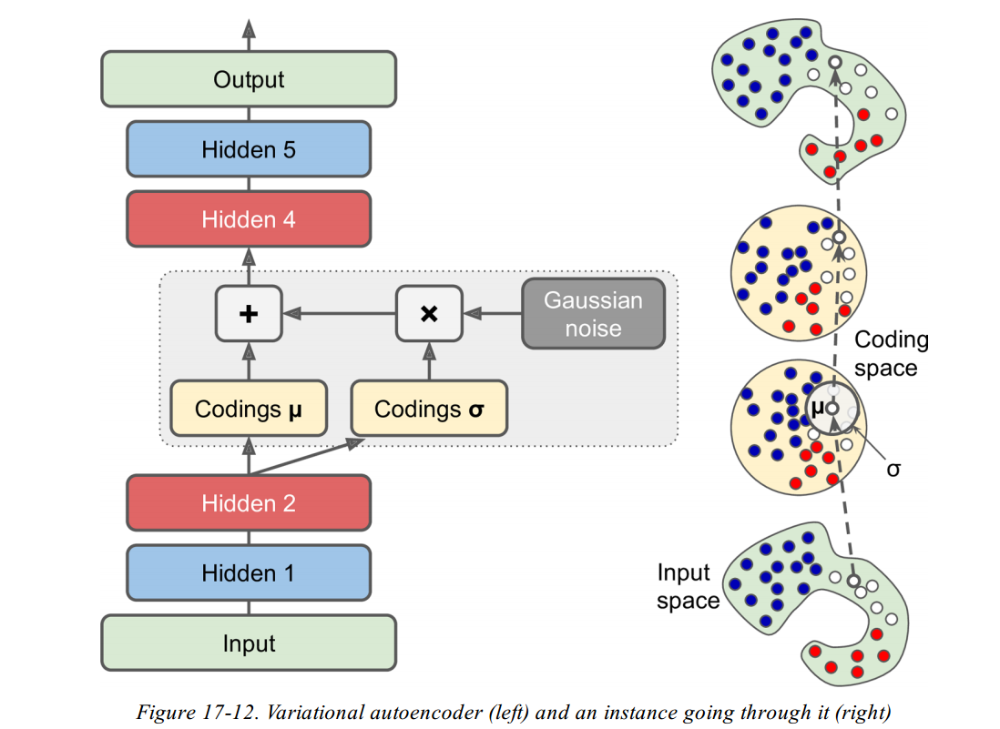
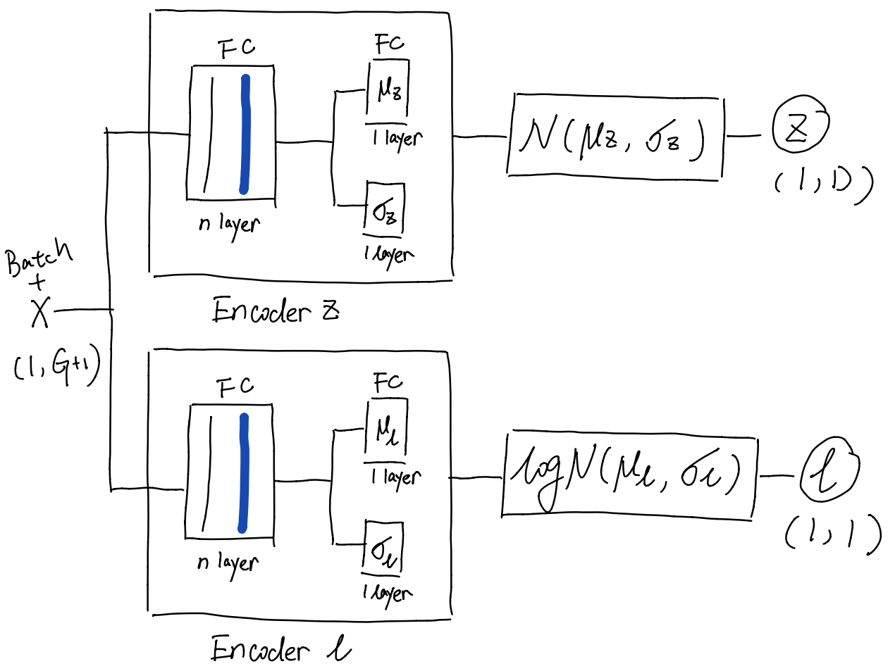

```{r setup, include = FALSE}
options(htmltools.dir.version = FALSE)
library(knitr)
library(tidyverse)
library(xaringanExtra)
# set engines
knitr::knit_engines$set("markdown")
xaringanExtra::use_tile_view()
xaringanExtra::use_panelset()
```
# Table of Contents

.extraLarge[
1. Introduction
1. Review scVI
1. LDVAE modifies scVI
1. Trade-off: Reconstruction vs. Interpretability
1. Probabilistic PCA

]


<!-- whereas typically autoencoder models are designed with the same network topology in the inference functions and the reconstruction functions, what we propose is a restricted reconstruction function that leads to an increase in reconstruction error. However, by virtue of being linear, our reconstruction function provides an interpretable link between gene programs and cellular molecular phenotypes -->

???
---

# Introduction: TL; DR

.extraLarge[
- The author replaces the non-line decoder of scVI with a linear transformation.
- It gives interpretable loading for the latent variables while sacrifice the 
ability of reconstruction.
- Explore logit Normal vs. Normal distribution for the lantent variable.
- Explore the effect of batch normalization during training period.
]
---

# Introduction: VAE

.panelset[
.panel[.panel-name[Autoencoder]
```{r picture-knitr-1, eval=TRUE, echo=FALSE,fig.align = 'center'}

```
]
.panel[.panel-name[Variational Autoencoder]
```{r picture-knitr-2, eval=TRUE, echo=FALSE, out.width="85%",fig.align = 'center'}

```
]
]
---

# Review scVI: Architecture

.panelset[
.panel[.panel-name[Encoder]
```{r, eval=TRUE, echo=FALSE, out.width="73%",fig.align = 'center', fig.cap='Variational Model'}

```
]
.panel[.panel-name[Decoder]
```{r, eval=TRUE, echo=FALSE, out.width="80%",fig.align = 'center', fig.cap='Generative Model'}

```
]
.panel[.panel-name[Loss Function]
Suppose:
- $x$ is the cell by gene matrix $(c, g)$. 
- $\hat{\mu}_{l}$ and $\hat{\sigma}_{l}$ are about size factors estimated from mini-batch.
- $\theta^g$ is the gene-wise dispersion estimated from the dataset.
- $\mu$ is the output from the decoder, as the rate of $\operatorname{NB}$.

Loss = Reconstruction Loss + KL Divergence Loss
- Reconstruction Loss
$$-\log P(x| \operatorname{NB}(\mu, \theta^g))$$
- KL Divergence Loss
$$\operatorname{KL}(\mathcal{N}(\mu_z, \sigma_z), \mathcal{N}(0,1)) + \operatorname{KL}(\mathcal{N}(\mu_l, \sigma_l), \mathcal{N}(\hat{\mu}_{l}, \hat{\sigma}_{l}))$$
]
]

<!-- --- -->

<!-- # Review scVI: Randomness vs. Stability -->

---

# LDVAE modifies scVI
.panelset[
.panel[.panel-name[LDVAE Encoder]
```{r, eval=TRUE, echo=FALSE, out.width="70%",fig.align = 'center', fig.cap='Generative Model'}

```
]
.panel[.panel-name[LDVAE Decoder]
```{r, eval=TRUE, echo=FALSE, out.width="80%",fig.align = 'center', fig.cap='Generative Model'}

```
]
.panel[.panel-name[Same Loss Function]
Suppose:
- $x$ is the cell by gene matrix $(c, g)$. 
- $\hat{\mu}_{l}$ and $\hat{\sigma}_{l}$ are about size factors estimated from mini-batch.
- $\theta^g$ is the gene-wise dispersion estimated from the dataset.
- $\mu$ is the output from the decoder, as the rate of $\operatorname{NB}$.

Loss = Reconstruction Loss + KL Divergence Loss
- Reconstruction Loss
$$-\log P(x| \operatorname{NB}(\mu, \theta^g))$$
- KL Divergence Loss
$$\operatorname{KL}(\mathcal{N}(\mu_z, \sigma_z), \mathcal{N}(0,1)) + \operatorname{KL}(\mathcal{N}(\mu_l, \sigma_l), \mathcal{N}(\hat{\mu}_{l}, \hat{\sigma}_{l}))$$
]
]

???

The only difference LDVAE makes to scVI is to replace the encoder with a linear transformation.

---

# Dataset
.pull-left[
- The first dataset (Pijuan-Sala et al., 2019) consists of 125 775 cells from 411 mouse embryos undergoing gastrulation measured using the commercial 10× Genomics platform and sequenced relatively deeply (11% non-zero values).
]
.pull-right[
- The second dataset (Cao et al., 2019) consists of 1 949 131 cells from 61 embryos in total using the sci-RNA-seq method at shallow sequencing (2% non-zero values). 
- This dataset is, to our knowledge, the largest scRNA-seq study published to date. 
]

???

To illustrate the scalability of our model, we fit a 10-dimensional LDVAE to the data which allows identification of cells similar to each other and for the determination of covarying genes
---

# Trade-off: Reconstruction
Using a normal latent distribution and batch norm has the smaller reconstruction error.

```{r, eval=TRUE, echo=FALSE, out.width="90%",fig.align = 'center', fig.cap='Fig 1 (b) Comparison of reconstruction error on the Pijuan-Sala et al. (2019) data with VAE and the four variants of LDVAE after running 100 epochs.'}

```

???
Question: Given the 

---

# Trade-off: Interpretability with $\mathcal{N}$
(c) Results from fitting a 20-dimensional LDVAE with Normal Distribution. Top genes indicated as vectors with names.

.panelset[
.panel[.panel-name[Fig-1c:row 1,2]
.pull-left[
- Left column: Density plots of the cells in representation space. 
- Right column: Scatter plots of gene loadings corresponding to the representation coordinates. 

]
.pull-right[
```{r, eval=TRUE, echo=FALSE, out.width="100%",fig.align = 'right'}

```
]

]
.panel[.panel-name[Fig-1c:row 4,5]
.pull-left[
The last row shows a pair of factors which discriminates three cell types annotated by Pijuan-Sala et al. (2019).
- red: erythroid
- blue: extraembryonic endoderm
- green: epiblast
]
.pull-right[
```{r, eval=TRUE, echo=FALSE, out.width="100%",fig.align = 'right'}

```
]

]
]

---

# Trade-off: Interpretability with $\operatorname{logit}\mathcal{N}$
Since a factor z is restricted to non-negative values, genes with negative weights $w$ can only decrease in expression as a function of z⁠. This way cells using a particular regulatory program can more effectively be grouped to specific factors
.panelset[
.panel[.panel-name[Sup Fig-2:row 1,2]
.pull-left[
- Left column: Density plots of the cells in representation space. 
- Right column: Scatter plots of gene loadings corresponding to the representation coordinates. 

]
.pull-right[
```{r, eval=TRUE, echo=FALSE, out.width="100%",fig.align = 'right'}

```
]

]
.panel[.panel-name[Sup Fig-2:row 4,5]
.pull-left[
The last row shows a pair of factors which discriminates three cell types annotated by Pijuan-Sala et al. (2019).
- red: erythroid
- blue: extraembryonic endoderm
- green: epiblast
]
.pull-right[
```{r, eval=TRUE, echo=FALSE, out.width="100%",fig.align = 'right'}

```
]
]
]

---

# Trade-off: Interpretability with $\hat{Z}^T\hat{Z}$
Sup Fig 3 with Pijuan-sala et al 2019
.panelset[
.panel[.panel-name[LDVAE Batch Norm]
Simplicial structure: one factor is always linearly dependent on the others.

.pull-left[
```{r, eval=TRUE, echo=FALSE, out.width="100%",fig.align = 'left'}

```
]
.pull-right[
```{r, eval=TRUE, echo=FALSE, out.width="100%",fig.align = 'right'}

```
]

]
.panel[.panel-name[LDVAE no Batch Norm]
Simplicial structure: one factor is always linearly dependent on the others.

.pull-left[
```{r, eval=TRUE, echo=FALSE, out.width="100%",fig.align = 'left'}

```
]
.pull-right[
```{r, eval=TRUE, echo=FALSE, out.width="100%",fig.align = 'right'}

```
]
]
.panel[.panel-name[LDVAE vs. scVI]
LDVAE learns representations with fewer covarying factors.
.pull-left[
```{r, eval=TRUE, echo=FALSE, out.width="100%",fig.align = 'left'}

```
]
.pull-right[
```{r, eval=TRUE, echo=FALSE, out.width="100%",fig.align = 'right'}

```
]
]
]
---

# Discussion: $\hat{Z}^T\hat{Z}$ Plot

I cannot observe the Simplicial structure...

```{r, eval=TRUE, echo=FALSE, out.width="85%",fig.align = 'center'}

```

---

# Discussion: PCA

In the introduction section, the author mentioned that 
> PCA models data as arising from a continuous multivariate Gaussian distribution, and thus optimizes a Gaussian likelihood. 

Also, 
> This model assumption is at odds with the count data measured in single-cell RNA-seq, and leads to interpretation problems (Hicks et al., 2018). 

I believe everyone agree with the author that PCA is not the best tools for 
scRNA-seq data. But the author's reason is about the assumption of 
Probabilistic PCA, which is different from the standard PCA in Seurat and Scanpy.

---

## Standar PCA

Use orthogonal projection of the data onto a principle subspace such that
- Maximum the variance of the projected data.
- Minimize the squared distance between the data points and the projections.

The two definitions are equivalent and can be solved by SVD.

## Probabilistic PCA
$$\boldsymbol{z} \sim N(0, \boldsymbol{I})$$
$$\boldsymbol{x} \sim N(\boldsymbol{Wz} + \boldsymbol{\mu}, \sigma^2 \boldsymbol{I})$$
$$\boldsymbol{W}_{ML} = \boldsymbol{U}_M(\boldsymbol{L}_M - \sigma^2 \boldsymbol{I})^{1/2}\boldsymbol{R}$$
- $\boldsymbol{U}_M$ is a combination of eigenvectors of the data covariance matrix.
- $\boldsymbol{L}_M$ is a diagonal matrix with eigenvalues $\lambda_i$.
- $\boldsymbol{R}$ is an arbitrary orthogonal matrix.
